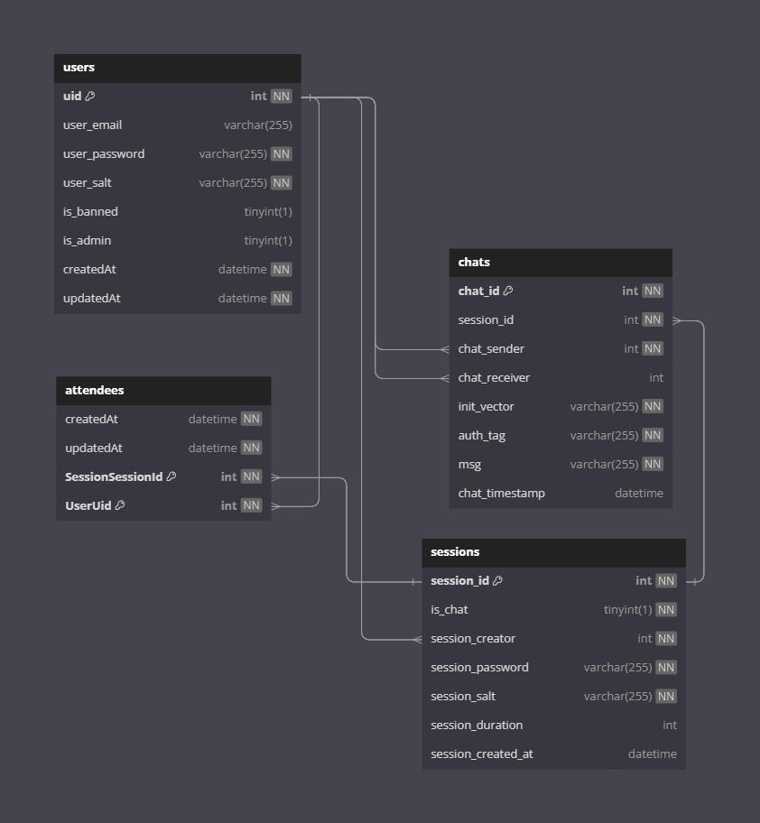

# PipeX

PipeX is an online conferencing web application, based on a mesh WebRTC architecture.

## Table of Contents

- [Technologies Used](#technologies-used)
- [Database Schema](#database-schema)
- [API Endpoints](#api-endpoints)
- [Socket Endpoints](#socket-endpoints)
- [Setup](#setup)
- [Usage](#usage)
- [License](#license)

## Technologies Used

- **Node.js**: The server-side runtime environment.
- **React**: To build the web UI for the users.
- **Socket.io**: To facilitate the communication.
- **Express.js**: Web application framework for Node.js.
- **MySQL**: SQL database for storing user execution statistics.
- **Sequelize**: ORM for the MySQL database.
- **JWT**: To provide secure transmission of information.
- **BCrypt**: To store user data securely in the database.
- **Typescript**: To provide early error detection, while writing the code.

## Database Schema

PipeX utilizes MySQL to store user info, chat logs, & session information. Below is a representation of the database schema:

## API Endpoints

PipeX exposes the following API endpoints for interaction:

- Note that the absence of a response implies the return of a HTTP response code only.

- `/`
  - **Method**: GET
  - **Description**: Used to check connection to server. 

- `/api/users/authenticate`
  - **Method**: POST
  - **Description**: Authenticates the user, returns a token if successful.
  - **Parameters**: 
    - `email`: User email.
    - `password`: User password.
  - **Response**:
    - `token`: JWT token valid for 24h.  

- `/api/users/admin/allUsers`
  - **Method**: POST
  - **Description**: Returns a list of all users in the database.
  - **Parameters**:
    - `Authorization header`: having the a valid admin token.  
  - **Response**:
    - `users`: List of all user emails.  

- `/api/users/userData`
  - **Method**: POST
  - **Description**: Returns user data and statistics.
  - **Parameters**:
    - `Authorization header`: having the a valid user token.  
  - **Response**:
    - `user`: user data.
    - `statistics`: user statistics.  

- `/api/users/register`
  - **Method**: POST
  - **Description**: Creates a new user, returns a token if successful.
  - **Parameters**: 
    - `email`: User email.
    - `password`: User password.
  - **Response**:
    - `token`: JWT token valid for 24h.  

- `/api/users/admin/createUser`
  - **Method**: POST
  - **Description**: Creates a new user. User can be an admin.
  - **Parameters**:
    - `Authorization header`: having the a valid admin token.
    - `email`: user email.
    - `password`: user password.
    - `isAdmin`: true the new user is an admin.
  - **Response**:
    - `token`: JWT token valid for 24h.

- `/api/users/admin/deleteUser`
  - **Method**: DELETE
  - **Description**: Deletes a user, along with its statistics.
  - **Parameters**:
    - `Authorization header`: having the a valid admin token.
    - `email`: email of user to delete.
   
- `/api/users/admin/setUserBanStatus`
  - **Method**: POST
  - **Description**: Bans/unbans a user.
  - **Parameters**:
    - `Authorization header`: having the a valid admin token.
    - `email`: email of user to ban/unban.
    - `isBanned`: true bans user, false unbannes user if banned.
   
- `/api/users/updateUser`
  - **Method**: POST
  - **Description**: Updates the user.
  - **Parameters**:
    - `Authorization header`: having the user token.
    - `newEmail`: new email of the user, optional.
    - `newPassword`: new password of the user, optional.
   
- `/api/sessions/sessionInfo`
  - **Method**: POST
  - **Description**: Returns the session information.
  - **Parameters**:
    - `Authorization header`: having the user token.
    - `sessionToken`: ID of the session, or a valid session token.
  - **Response**:
    - `session`: Infomration about the session.
    - `chat`: Session chat log.
    - `attendees`: Users that attended the session.

 - `/api/sessions/sessionInfo`
  - **Method**: POST
  - **Description**: Returns list of session IDs belonging to the user.
  - **Parameters**:
    - `Authorization header`: having the user token.
  - **Response**:
    - `sessionIds`: List of integers, each representing a session ID.

## Socket Endpoints

## Setup

- On Windows: follow this manual (https://docs.docker.com/desktop/wsl) to get Linux based containers to work on your machine.
- On Linux: make sure to have Docker installed.
   
1. Clone the repository: `git clone https://github.com/YamanSD/dexter.git`
2. Install dependencies: `npm install`
3. Set up the MySQL connection in the [.env](./.env) configuration file. **ALL** parameters must be filled.
4. Start the application: `npm start`

- By default, each user is given 60 seconds of execution time and 100 MiB of execution memory. To change these parameters, refer to [containerConfig.ts](./exec/containerConfig.ts).

## Usage

- To test the API, you must install Postman or any equivalent application of your choice.

- First and formost, you must create a new image, as non-exist.
  - An example [Dockerfile](./Dockerfile) that installs Ubuntu and the GCC compiler is provided.

- Have Docker and MySQL running on your machine, then start the Node.js server using `npm start` in the project directory.

- Next go to Postman and check the connection using `http://YOUR_IP:YOUR_PORT`, that you provided in the [.env](./.env) file. If you get a response, then MySQL is working properly.

- You must then authenticate using the super user using the `/api/users/authenticate` end point. No need to create the super user, they are automatically created. If successful you will receive a JWT token that you have to copy. Paste the token in the headers of requests as `Authorization`.

- Next we have to create an image using `/api/docker/super/createImage`.
  In the `dockerfile` field, copy paste the example [Dockerfile](./Dockerfile),
  and make sure to replace all new lines with `\n` in the dockerfile string field in the JSON request body. The `version` field can be any positive integer you want. It will take some time to receive a response, as the image content is being downloaded.

- If the server crashes in the previous step, make sure you have setup Docker correctly.

- We then use the image we created using `/api/docker/super/setCurrentImage`. Where the `version` is the integer we provided earlier.

- If all is good, we have to then create a programming language using `/api/docker/super/createLanguage`. For this example, we will create C.
In the `name` field, add any name you want (C, c_gcc, etc...), but make sure it is a clear name, as it cannot be changed later. In the `mainFile` field add `main.c`, as C files end with `.c` extension. The `startCommand` should be `gcc main.c -o app && ./app`, this will compile the main.c file and run it directly.

- Next we have to link the language to the image using `/api/docker/super/linkLanguages`. In the `version` field, add the version you previously used for your image. In the `langs` add `[YOUR_C_NAME]`.

- We can use the superuser to execute code, but for the sake of the demo we can create a user using `/api/users/register`, and we get back a new token.

- Now we have to test if execution works using `/api/exec/execute`.
  We add our new token in the header. In the `program` field we add our C program; we will use the (example.c)[./example.c]. We copy the content, then we have convert it into a JSON valid string. All special characters must have their backslashes doubled, and all double quotes must be backslashed. Any non-double escaped character will be interpreted literally by the server.
  Next, we have to sepcify the language `lang`, which is the name we used for C eariler. And finally we have to provide `input` as the, program requires input ("1 100", for example). We run and we should get the sum of integers from 1 to 100, if using the `example.c`.

## License

This project is licensed under the [MIT License](LICENSE).
